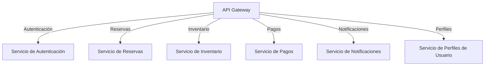

# Arquitectura del Sistema de Microservicios

Este documento describe la arquitectura del sistema de microservicios diseñado para la gestión de reservas de habitaciones. El sistema está compuesto por varios servicios independientes que se comunican entre sí a través de un API Gateway.

## Componentes del Sistema

1. **API Gateway**: 
   - Punto de entrada para todas las solicitudes del cliente.
   - Redirige las solicitudes a los servicios correspondientes.
   - Maneja la autenticación y autorización.

2. **Servicios de Microservicios**:
   - **Servicio de Autenticación**: 
     - Gestiona el registro, inicio de sesión y gestión de sesiones de usuarios.
   - **Servicio de Reservas**: 
     - Permite a los usuarios crear, modificar y cancelar reservas de habitaciones.
   - **Servicio de Inventario**: 
     - Gestiona la disponibilidad de habitaciones y su información.
   - **Servicio de Pagos**: 
     - Procesa las transacciones de pago y verifica su estado.
   - **Servicio de Notificaciones**: 
     - Envía notificaciones a los usuarios a través de correo electrónico y SMS.
   - **Servicio de Perfiles de Usuario**: 
     - Gestiona la información y preferencias de los usuarios.

## Comunicación entre Servicios

Los servicios se comunican entre sí utilizando HTTP/REST. Cada servicio tiene su propia base de datos, lo que permite una mayor independencia y escalabilidad. La comunicación se realiza a través de endpoints definidos en cada servicio.

## Diagrama de Arquitectura

El siguiente diagrama ilustra la arquitectura del sistema:

## Consideraciones de Diseño

- **Escalabilidad**: Cada servicio puede escalar de forma independiente según la demanda.
- **Seguridad**: Se implementan medidas de seguridad en el API Gateway para proteger los datos de los usuarios.
- **Mantenibilidad**: La separación de servicios permite un desarrollo y mantenimiento más sencillo.
- **Despliegue**: Cada servicio puede ser desplegado de manera independiente, facilitando actualizaciones y mejoras.

## Conclusión

La arquitectura de microservicios propuesta proporciona una solución flexible y escalable para la gestión de reservas de habitaciones, permitiendo una fácil integración de nuevas funcionalidades y servicios en el futuro.