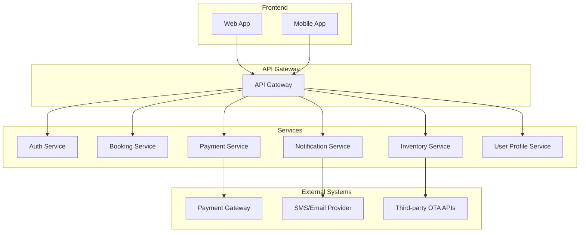
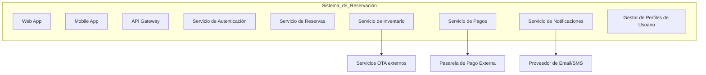
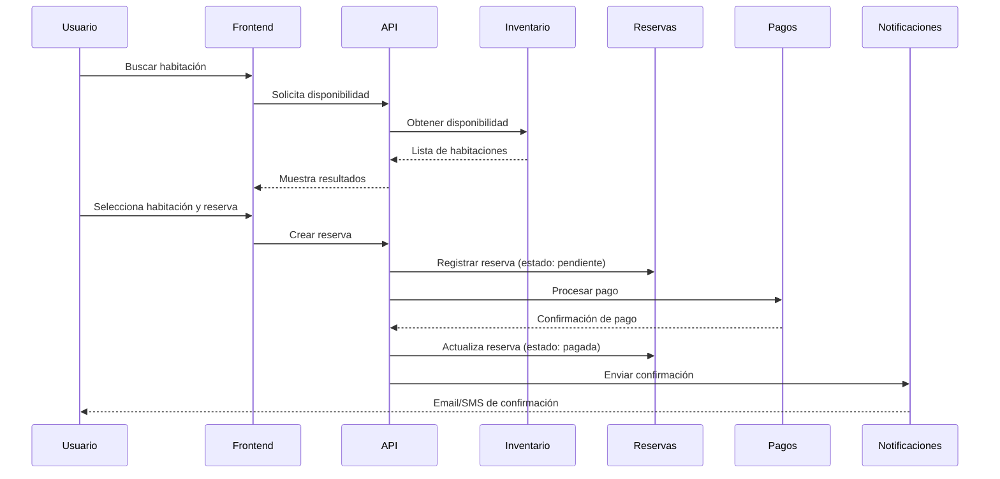
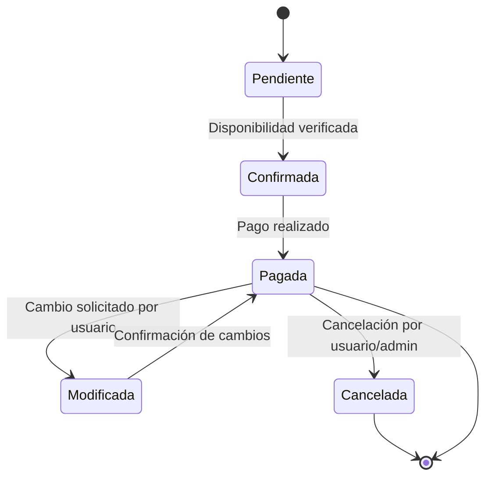

# Diagrama de Arquitectura de Microservicios

Este documento contiene los diagramas que ilustran la arquitectura y el flujo del sistema de microservicios para el sistema de reservación de habitaciones.

## Diagrama de Arquitectura de Software

## Diagrama de Componentes

## Diagrama de Secuencias

## Diagrama de Transición de Estados

